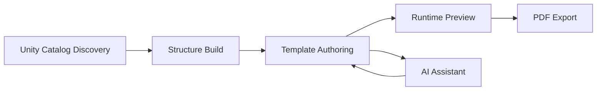

<p align="center">
  
  
  
</p>

<h1 align="center">dbx-paginated-reporting</h1>

<p align="center">
  <strong>Enterprise-style paginated reporting on Databricks with Designer + HTML authoring, runtime parameter filtering, and PDF export.</strong>
  <br />
  FastAPI &bull; Vue 3 &bull; Lakebase &bull; Unity Catalog &bull; Databricks SQL
</p>

<p align="center">
  <a href="#quick-start">Quick Start</a> &bull;
  <a href="#how-it-works">How It Works</a> &bull;
  <a href="#repository-structure">Structure</a> &bull;
  <a href="#api-surface">API</a> &bull;
  <a href="#troubleshooting">Troubleshooting</a>
</p>

---

## The Problem

Most paginated reporting workflows are fragmented across multiple tools and manual steps. Teams need to:
- discover source data
- define repeatable metadata
- build templates with business logic
- validate runtime filters against real data
- export consistent print/PDF outputs

This project solves that end-to-end in a single Databricks-aligned application.

## What This Project Delivers

| Capability | Description |
|---|---|
| **Unity Catalog Discovery** | Browse catalogs, schemas, tables, and columns through API-backed explorer flows |
| **Metadata Structures** | Persist report data structures in Lakebase and infer fields from selected sources |
| **Dual Authoring Modes** | Build reports in `Designer` mode or `HTML` advanced mode with Mustache syntax |
| **Runtime Filter Testing** | Apply parameters in preview and execute backend-filtered Databricks SQL queries |
| **Paginated PDF Export** | Render and export print-ready reports with configurable page setup |
| **AI-Assisted Development** | Use chat endpoints backed by Databricks Model Serving for report assistance |

---

## Quick Start

### Prerequisites

- Python `3.11+`
- Node.js `18+`
- npm `9+`
- Databricks workspace access
- configured SQL warehouse and Lakebase credentials

### 1) Start Backend

```bash
cd back-end
pip install -r requirements.txt
uvicorn app:app --reload --port 8012
```

### 2) Start Frontend

```bash
cd front-end
npm install
VITE_API_PROXY_TARGET=http://127.0.0.1:8012 npm run dev -- --port 5180
```

### 3) Open Application

- [http://localhost:5180](http://localhost:5180)

---

## How It Works



### Flow

1. **Discovery**: select source data from Unity Catalog.
2. **Structure Build**: infer fields and persist structure/query metadata.
3. **Template Authoring**: design report layout in Designer or HTML mode.
4. **Preview**: test parameters and backend filters on real data.
5. **Export**: generate full paginated PDF output.

---

## Architecture

### Backend

- FastAPI (`back-end/app.py`)
- repository layer over Lakebase/PostgreSQL
- Databricks SQL connector for data execution
- Model Serving connector for AI chat
- route modules for structures, templates, discovery, and agent

### Frontend

- Vue 3 + TypeScript + Vite
- TanStack Query for API state
- Pinia for view state (`active template/structure`)
- CodeMirror editor for advanced template editing
- Mustache-based render pipeline

---

## Repository Structure

```text
dbx-paginated-reporting/
├── back-end/
│   ├── app.py
│   ├── common/
│   │   ├── config.py
│   │   ├── connectors/
│   │   └── factories/
│   ├── migrations/
│   ├── models/
│   ├── repositories/
│   ├── routes/v1/
│   ├── services/
│   └── static/
├── front-end/
│   ├── src/
│   │   ├── api/
│   │   ├── components/
│   │   ├── stores/
│   │   ├── utils/
│   │   └── views/
│   ├── vite.config.ts
│   └── orval.config.ts
└── examples/
    ├── general_ledger_all_features_template.html
    └── general_ledger_ssrs_demo_template.html
```

---

## Environment Configuration

Primary backend variables (see `back-end/.env.example` for complete reference):

- `DATABRICKS_HOST`
- `DATABRICKS_TOKEN` (or OAuth credentials)
- `DATABRICKS_WAREHOUSE_ID` or `DATABRICKS_WAREHOUSE_PATH`
- `LAKEBASE_INSTANCE_NAME`
- `LAKEBASE_DATABASE_NAME`
- `MODEL_SERVING_ENDPOINT` (default fallback: `databricks-claude-sonnet-4-6`)

---

## API Surface

### Structures
- `GET /api/v1/structures/`
- `POST /api/v1/structures/`
- `PUT /api/v1/structures/{structure_id}`
- `POST /api/v1/structures/{structure_id}/build`

### Templates
- `GET /api/v1/templates/`
- `POST /api/v1/templates/`
- `PUT /api/v1/templates/{template_id}`
- `POST /api/v1/templates/{template_id}/preview-data`
- `POST /api/v1/templates/{template_id}/parameter-options`

### AI Agent
- `POST /api/v1/agent/chat`
- `WS /api/v1/agent/ws`

---

## Rendering Contract

Template rendering uses a `rows` array payload.

```json
{
  "rows": [
    { "txn_id": "TXN-1001", "department": "FIN", "_index": 1, "_total": 2 },
    { "txn_id": "TXN-1002", "department": "OPS", "_index": 2, "_total": 2 }
  ]
}
```

Supported examples:
- scalar: `{{field}}`
- list: `{{#rows}} ... {{/rows}}`
- object path: `{{customer.name}}`
- nested list: `{{#line_items}} ... {{/line_items}}`

---

## Reliability Notes

To prevent template cross-write during fast switching:
- autosave uses template snapshot guards
- stale async save requests are discarded
- template identity remains UUID-based

Recommended enterprise hardening:
- optimistic locking on template update (`version` or `updated_at` check)

---

## Troubleshooting

### Frontend loads but API calls fail
- verify backend is running on expected port
- verify `VITE_API_PROXY_TARGET` points to backend

### Preview returns empty rows
- validate structure query and selected columns
- check runtime filters in Preview debug panel

### Host mismatch (`localhost` vs `127.0.0.1`)
- use the host shown by Vite startup logs

---

<p align="center">
  Built for Databricks-native reporting workflows.
</p>
