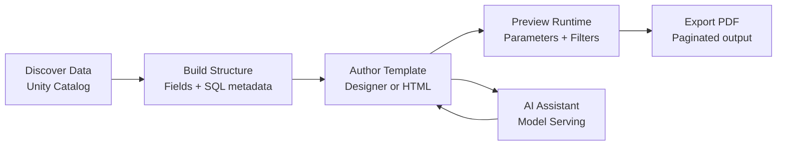
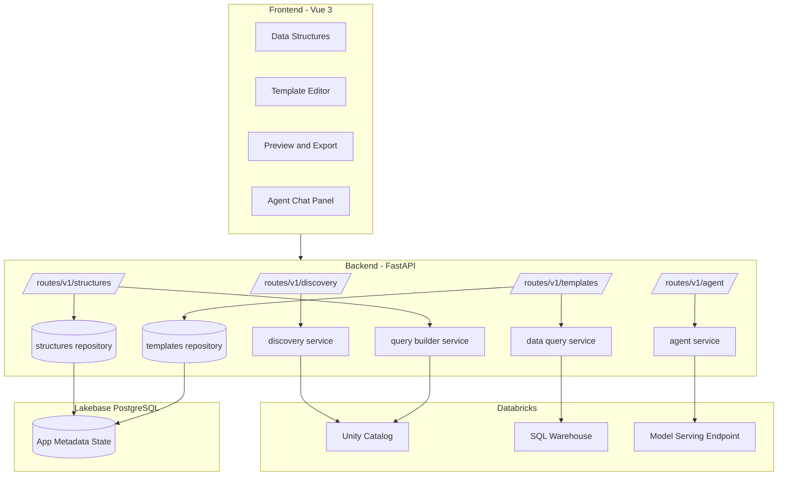

<p align="center">
  
  
  
  
</p>

<h1 align="center">dbx-paginated-reporting</h1>

<p align="center">
  <strong>Production-oriented paginated reporting platform for Databricks.</strong>
  <br />
  Build, validate, and export metadata-driven reports with a full-stack workflow.
</p>

<p align="center">
  <a href="#quick-start">Quick Start</a> &bull;
  <a href="#platform-capabilities">Capabilities</a> &bull;
  <a href="#architecture">Architecture</a> &bull;
  <a href="#developer-runbook">Developer Runbook</a> &bull;
  <a href="#api-surface">API</a> &bull;
  <a href="#troubleshooting">Troubleshooting</a>
</p>

---

## Why This Project

Paginated reporting pipelines usually break across too many moving pieces:
- source discovery and metadata live in one place
- template logic lives somewhere else
- runtime filtering is tested manually
- export behavior diverges from preview

This project consolidates those concerns into one Databricks-native product with strict metadata flow and repeatable report output.

## Platform Capabilities

| Capability | What It Enables |
|---|---|
| **Unity Catalog Discovery** | Browse catalogs, schemas, tables, and columns through backend APIs |
| **Metadata Structures** | Persist report data structures and generated SQL context in Lakebase |
| **Dual Authoring Modes** | Use `Designer` mode for metadata-led layouts, or `HTML` mode for full Mustache control |
| **Runtime Filter Validation** | Apply parameter overrides and verify backend query behavior in preview |
| **Deterministic Pagination** | Render report pages with consistent row chunking and print-safe styles |
| **PDF Export** | Export full datasets as paginated print-ready output |
| **AI Assistant** | Use Databricks Model Serving chat endpoints for guided report development |

## End-to-End Workflow



## Architecture



---

## Quick Start

### Prerequisites

- Python `3.11+`
- Node.js `18+`
- npm `9+`
- Databricks workspace access
- configured SQL warehouse and Lakebase credentials

### 1) Backend

```bash
cd back-end
pip install -r requirements.txt
uvicorn app:app --reload --port 8012
```

### 2) Frontend

```bash
cd front-end
npm install
VITE_API_PROXY_TARGET=http://127.0.0.1:8012 npm run dev -- --port 5180
```

### 3) Open App

- [http://localhost:5180](http://localhost:5180)

---

## Environment Configuration

Backend values are defined in `back-end/.env` (see `back-end/.env.example`).

| Variable | Purpose |
|---|---|
| `DATABRICKS_HOST` | Workspace host |
| `DATABRICKS_TOKEN` | Personal access token (or OAuth path) |
| `DATABRICKS_WAREHOUSE_ID` | SQL warehouse ID (preferred) |
| `DATABRICKS_WAREHOUSE_PATH` | SQL warehouse HTTP path fallback |
| `LAKEBASE_INSTANCE_NAME` | Lakebase instance identifier |
| `LAKEBASE_DATABASE_NAME` | Lakebase database name |
| `MODEL_SERVING_ENDPOINT` | Model endpoint for AI assistant |

Default model endpoint fallback in code:
- `databricks-claude-sonnet-4-6`

---

## Product Areas

### Data Structures
- define source table context
- infer field metadata from source columns
- build SQL query metadata used by preview and export

### Template Editor
- `Designer` mode for business-friendly layout control
- `HTML` mode for advanced Mustache customization
- autosave behavior with template-switch guards

### Preview and Export
- runtime parameter override panel
- backend query filter, sort, group controls
- query/debug trace visibility
- full export fetch with paginated render

### AI Assistant
- `POST /api/v1/agent/chat`
- `WS /api/v1/agent/ws`
- optional template-aware prompt injection

---

## API Surface

| Domain | Endpoint |
|---|---|
| Structures | `GET /api/v1/structures/` |
| Structures | `POST /api/v1/structures/` |
| Structures | `PUT /api/v1/structures/{structure_id}` |
| Structures | `POST /api/v1/structures/{structure_id}/build` |
| Templates | `GET /api/v1/templates/` |
| Templates | `POST /api/v1/templates/` |
| Templates | `PUT /api/v1/templates/{template_id}` |
| Templates | `POST /api/v1/templates/{template_id}/preview-data` |
| Templates | `POST /api/v1/templates/{template_id}/parameter-options` |
| Agent | `POST /api/v1/agent/chat` |
| Agent | `WS /api/v1/agent/ws` |

---

## Developer Runbook

### Frontend Commands

```bash
cd front-end
npm run dev
npm run type-check
npm run lint
npm run build
npm run generate-all
```

### Backend Notes

- API app entrypoint: `back-end/app.py`
- route modules: `back-end/routes/v1/*`
- service layer: `back-end/services/*`
- persistence layer: `back-end/repositories/*`
- seed + migrations: `back-end/migrations/__init__.py`

### OpenAPI Regeneration

If backend contracts change:

```bash
cd front-end
OPENAPI_URL=http://127.0.0.1:8012/openapi.json npm run generate-all
```

---

## Repository Structure

```text
dbx-paginated-reporting/
├── back-end/
│   ├── app.py
│   ├── common/
│   │   ├── config.py
│   │   ├── connectors/
│   │   └── factories/
│   ├── migrations/
│   ├── models/
│   ├── repositories/
│   ├── routes/v1/
│   ├── services/
│   └── static/
├── front-end/
│   ├── src/
│   │   ├── api/
│   │   ├── components/
│   │   ├── stores/
│   │   ├── utils/
│   │   └── views/
│   ├── vite.config.ts
│   └── orval.config.ts
└── examples/
    ├── general_ledger_all_features_template.html
    └── general_ledger_ssrs_demo_template.html
```

---

## Reliability and Guardrails

Implemented safeguards:
- template UUID identity model
- guarded autosave snapshot logic
- stale async save suppression during template switching

Recommended next hardening:
- optimistic locking (`updated_at` or `version`) for concurrent editors

---

## Troubleshooting

### Frontend opens but API calls fail
- verify backend is running on expected port
- verify `VITE_API_PROXY_TARGET` value

### Preview returns no rows
- verify structure query and selected columns
- verify runtime filter values and debug output

### `localhost` and `127.0.0.1` mismatch
- use the exact host/port shown by Vite startup logs

---

<p align="center">
  Built for enterprise-grade Databricks reporting workflows.
</p>
